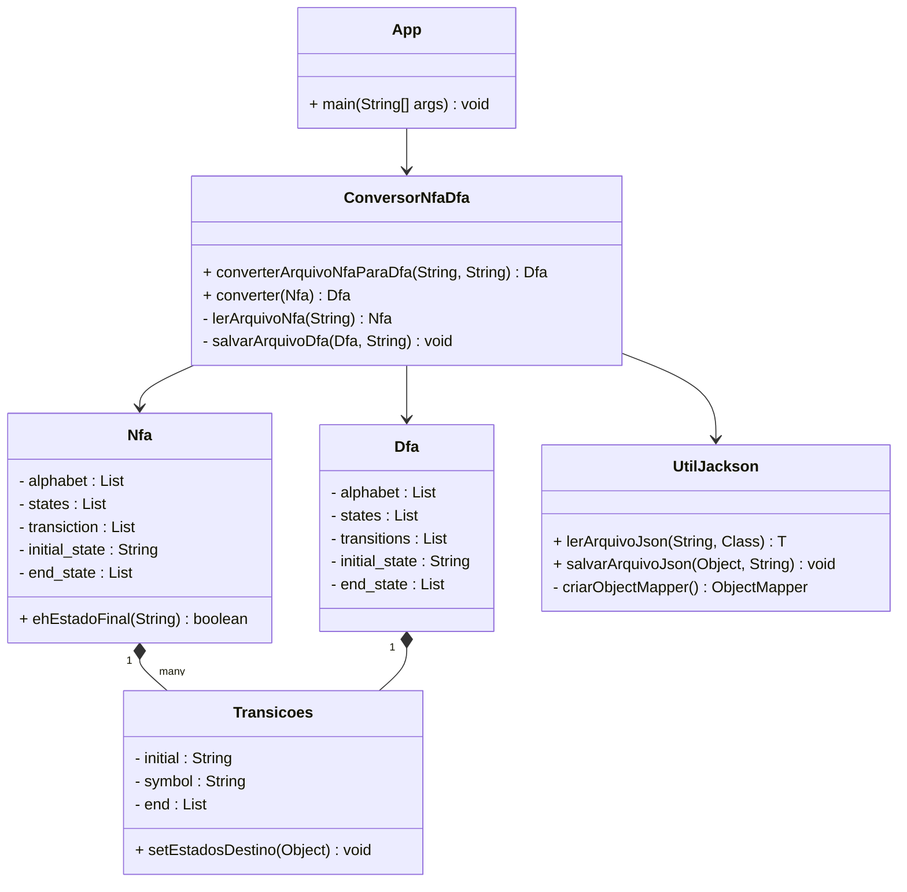

# Conversor NFA para DFA

## 📝 Descrição
Este projeto implementa um conversor de Autômatos Finitos Não-Determinísticos (NFA) para Autômatos Finitos Determinísticos (DFA). O sistema lê um arquivo JSON contendo a especificação do NFA e gera um novo arquivo JSON com o DFA equivalente.

## 🚀 Funcionalidades
- Leitura de NFA a partir de arquivo JSON
- Conversão automática de NFA para DFA
- Geração do DFA em formato JSON
- Validação de entrada e saída
- Tratamento de erros amigável

## 🔹 Exemplos Práticos de NFA → DFA

💻 Compiladores
 - Reconhecimento de padrões na análise léxica.
 - Tokens (palavras-chave, identificadores, números) são detectados via autômatos determinísticos.

🔍 Expressões Regulares
 - Motores de regex (Java, Python, grep, etc.) convertem regex em NFA → DFA para executar buscas rápidas.

🌐 Protocolos de Comunicação
 - Validação de sequências de mensagens em redes de computadores.

🎮 Inteligência Artificial e Jogos
 - Máquinas de estados finitos para controle de personagens, menus e interações.  

## 📁 Estrutura do Projeto
```
conversor-nfa-para-dfa/
│
├── src/
│   ├── main/
│   │   └── java/
│   │       └── com/
│   │           └── exemplo/
│   │               ├── model/
│   │               │   ├── Nfa.java
│   │               │   ├── Dfa.java
│   │               │   └── Transicoes.java
│   │               ├── conversor/
│   │               │   └── ConversorNfaDfa.java
│   │               ├── util/
│   │               │   └── UtilJackson.java
│   │               └── App.java
│   │
│   └── test/
│       └── java/
│           └── com/
│               └── exemplo/
│                   └── AppTest.java
│
├── arquivo.json
├── pom.xml
└── README.md
```


## 📊 Diagrama de Classes



## 📄 Formato do Arquivo de Entrada
Coloque seu arquivo NFA em formato JSON na pasta `conversor-nfa-para-dfa/` seguindo esta estrutura:

```json
{
    "alphabet": ["0", "1"],
    "states": ["q0", "q1", "q2"],
    "transiction": [
        {"initial": "q0", "symbol": "0", "end": ["q0", "q1"]},
        {"initial": "q0", "symbol": "1", "end": ["q0"]},
        {"initial": "q1", "symbol": "0", "end": "null"},
        {"initial": "q1", "symbol": "1", "end": ["q2"]},
        {"initial": "q2", "symbol": "0", "end": "null"},
        {"initial": "q2", "symbol": "1", "end": "null"}
    ],
    "initial_state": "q0",
    "end_state": ["q2"]
}
```


## 🔹 Como Funciona a Conversão

O método `converterNfaDfa` constrói o DFA a partir do NFA passo a passo.  
Aqui está uma representação visual de cada etapa, para facilitar a explicação:

---

### 1️⃣ Inicializar o DFA e definir o alfabeto
```java
Dfa dfa = new Dfa();
dfa.setAlphabet(new ArrayList<>(nfa.getAlphabet()));
```
💡 Visual:

```css
NFA Alphabet: {0,1}
DFA Alphabet: {0,1}
```
2️⃣ Estado inicial do DFA
```java
Set<String> initialNfaStates = new HashSet<>();
initialNfaStates.add(nfa.getInitial_state());
String initialState = formatStateSet(initialNfaStates);
dfaStates.add(initialState);
dfa.setInitial_state(initialState);
```
💡 Visual:

```yaml
Estado Inicial NFA: q0
Estado Inicial DFA: {q0}->(S0)
Fila: [{q0}]
```
3️⃣ Processamento com fila
Cada estado do DFA é processado uma vez.

Para cada símbolo do alfabeto, calculamos todos os estados possíveis do NFA.

Novos conjuntos formam novos estados do DFA.

```java
Queue<String> queue = new LinkedList<>();
queue.offer(initialState);
```
💡 Visual do processo:

```rust
Fila: [{q0}]

Processando {q0}:
  Símbolo '0' -> {q0,q1}->(S1)  <-- novo estado -> adicionar à fila
  Símbolo '1' -> {q0}->(S0)     <-- já existe
Fila atualizada: [{q0,q1}]
```
4️⃣ Construção das transições do DFA
```java
Transicoes transition = new Transicoes();
transition.setInitial(currentDfaState);
transition.setSymbol(symbol);
transition.setEnd(new ArrayList<>(Arrays.asList(nextDfaState)));
dfaTransitions.add(transition);
```
💡 Visual:

```lua
DFA Transitions:
{q0}(S0) --0--> {q0,q1}(S1)
{q0}(S0) --1--> {q0}(S0)
{q0,q1}(S1) --0--> {q0,q1}(S1)
{q0,q1}(S1) --1--> {q2}(S2)
```
5️⃣ Definição dos estados finais do DFA
```java
for (String dfaState : dfaStates) {
    Set<String> states = parseStateSet(dfaState);
    for (String nfaFinalState : nfa.getEnd_state()) {
        if (states.contains(nfaFinalState)) {
            finalStates.add(dfaState);
        }
    }
}
```
💡 Visual:

```yaml
NFA Final: q2
DFA Finais: {q2}(S2)  (qualquer conjunto que contenha q2)
```
6️⃣ Código completo com comentários didáticos

```java
public static Dfa converterNfaDfa(Nfa nfa) {

    // Inicializar DFA com o mesmo alfabeto do NFA
    Dfa dfa = new Dfa();
    dfa.setAlphabet(new ArrayList<>(nfa.getAlphabet()));

    // Listas para armazenar estados e transições
    List<String> dfaStates = new ArrayList<>();
    List<Transicoes> dfaTransitions = new ArrayList<>();

    // Estado inicial do DFA = {estado inicial NFA}
    Set<String> initialNfaStates = new HashSet<>();
    initialNfaStates.add(nfa.getInitial_state());
    String initialState = formatStateSet(initialNfaStates);
    dfaStates.add(initialState);
    dfa.setInitial_state(initialState);

    // Fila para processar estados
    Queue<String> queue = new LinkedList<>();
    queue.offer(initialState);

    // Processar cada estado do DFA
    while (!queue.isEmpty()) {
        String currentDfaState = queue.poll();
        Set<String> currentStates = parseStateSet(currentDfaState);

        for (String symbol : nfa.getAlphabet()) {
            Set<String> nextStates = new HashSet<>();

            for (String nfaState : currentStates) {
                Set<String> transitions = getTransitions(nfa, nfaState, symbol);
                nextStates.addAll(transitions);
            }

            if (!nextStates.isEmpty()) {
                String nextDfaState = formatStateSet(nextStates);

                // Adicionar novo estado se não existir
                if (!dfaStates.contains(nextDfaState)) {
                    dfaStates.add(nextDfaState);
                    queue.offer(nextDfaState);
                }

                // Adicionar transição
                Transicoes transition = new Transicoes();
                transition.setInitial(currentDfaState);
                transition.setSymbol(symbol);
                transition.setEnd(new ArrayList<>(Arrays.asList(nextDfaState)));
                dfaTransitions.add(transition);
            }
        }
    }

    // Definir estados finais
    List<String> finalStates = new ArrayList<>();
    for (String dfaState : dfaStates) {
        Set<String> states = parseStateSet(dfaState);
        for (String nfaFinalState : nfa.getEnd_state()) {
            if (states.contains(nfaFinalState)) {
                finalStates.add(dfaState);
                break;
            }
        }
    }

    // Configurar o DFA completo
    dfa.setStates(dfaStates);
    dfa.setTransiction(dfaTransitions);
    dfa.setEnd_state(finalStates);

    return dfa;
}
```
💡 Resumo Visual Final
```makefile
Fila de Processamento:
[{q0}] -> processa -> {q0,q1} -> processa -> {q2}

DFA:
Alfabeto: {0 , 1}
Estados: {q0}->(S0), {q0,q1}->(S1), {q2}->(S2)
Estado Inicial: {q0}->(S0)
Finais: {q2}->(S2)
Transições: conforme processadas
```

## 📝 Exemplos de Uso

1. Crie um arquivo `exemplo.json` na pasta `conversor-nfa-para-dfa/` com seu NFA
2. Execute o programa
3. Digite o nome do arquivo quando solicitado
4. O DFA resultante será gerado na mesma pasta com sufixo "_dfa"


## 🚀 Como Executar

1. **Clone o repositório** (opcional):
```bash
git clone [url-do-repositório]
cd conversor-nfa-para-dfa
```

2. **Compile o projeto**:
```bash
mvn clean install
```

3. **Execute o programa**:
```bash
mvn exec:java
```

## 📥 Ponto de Entrada (App.java)

```java
public class App {
    public static void main(String[] args) throws Exception {
        
        Scanner scanner = new Scanner(System.in);
        
        System.out.println("=== CONVERSOR NFA PARA DFA ===");
        System.out.println("Digite o nome do arquivo JSON do NFA (ex: exemplo01.json):");
        
        String arquivoNfa = scanner.nextLine().trim();
        

        if (arquivoNfa.isEmpty()) {
            System.out.println("Nenhum arquivo foi informado!!");
        }
        
        // Verificar se o arquivo existe
        if (!arquivoNfa.endsWith(".json")) {
            arquivoNfa += ".json";
        }
        
        String arquivoDfa = arquivoNfa.replace(".json", "_dfa.json");
        
        System.out.println("\nConvertendo " + arquivoNfa + " para " + arquivoDfa);
        
        try {
            Dfa dfa = ConversorNfaDfa.converterArquivoNfaParaDfa(arquivoNfa, arquivoDfa);
            
            System.out.println("\n CONVERSÃO CONCLUÍDA COM SUCESSO!");
            System.out.println(" Arquivo DFA gerado: " + arquivoDfa);

            
        } catch (Exception e) {
            System.err.println("ERRO na conversão: " + e.getMessage());
            System.err.println("Verifique se o arquivo " + arquivoNfa + " existe e está no formato correto.");
        }
        
        scanner.close();
    }
}
```

## 🛠️ Pré-requisitos
- Java 17 ou superior
- Maven
- Git (opcional)

## ⚙️ Configuração do Maven
O projeto utiliza as seguintes dependências principais:
- Jackson (2.20.0) para manipulação de JSON
- JUnit Jupiter (5.11.0) para testes

## ❗ Tratamento de Erros
O programa verifica:
- Existência do arquivo de entrada
- Formato correto do JSON
- Validação da estrutura do NFA
- Permissões de leitura/escrita

## 🤝 Contribuindo
1. Faça um fork do projeto
2. Crie uma branch para sua feature
3. Faça commit das alterações
4. Push para a branch
5. Crie um Pull Request


## 📫 Contato
Para dúvidas ou sugestões, abra uma issue no repositório.

---

Desenvolvido como projeto da disciplina de Linguagens Formais e Autômatos

---

**Autores:**  
- Gabriel Rodrigues Santos
- Maria Eduarda Machado
- Felipe Costa
- Tássio Moraes
