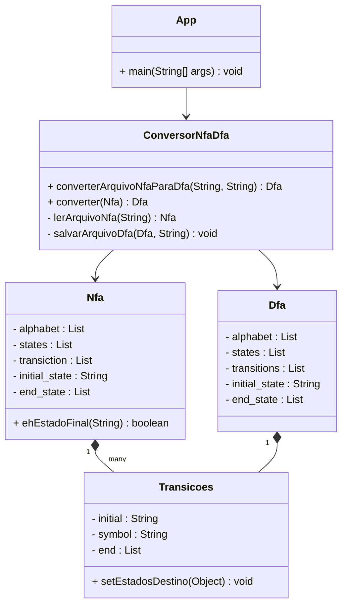

# Conversor NFA para DFA

## 📝 Descrição
Este projeto implementa um conversor de Autômatos Finitos Não-Determinísticos (NFA) para Autômatos Finitos Determinísticos (DFA). O sistema lê um arquivo JSON contendo a especificação do NFA e gera um novo arquivo JSON com o DFA equivalente.

## 🚀 Funcionalidades
- Leitura de NFA a partir de arquivo JSON
- Conversão automática de NFA para DFA
- Geração do DFA em formato JSON
- Validação de entrada e saída
- Tratamento de erros amigável

## 📁 Estrutura do Projeto
```
conversor-nfa-para-dfa/
│
├── src/
│   ├── main/
│   │   └── java/
│   │       └── com/
│   │           └── exemplo/
│   │               ├── model/
│   │               │   ├── Nfa.java
│   │               │   ├── Dfa.java
│   │               │   └── Transicoes.java
│   │               ├── conversor/
│   │               │   └── ConversorNfaDfa.java
│   │               ├── util/
│   │               │   └── UtilJackson.java
│   │               └── App.java
│   │
│   └── test/
│       └── java/
│           └── com/
│               └── exemplo/
│                   └── AppTest.java
│
├── arquivo.json
├── pom.xml
└── README.md
```

## 🛠️ Pré-requisitos
- Java 17 ou superior
- Maven
- Git (opcional)

## ⚙️ Configuração do Maven
O projeto utiliza as seguintes dependências principais:
- Jackson (2.20.0) para manipulação de JSON
- JUnit Jupiter (5.11.0) para testes

## 🚀 Como Executar

1. **Clone o repositório** (opcional):
```bash
git clone [url-do-repositório]
cd conversor-nfa-para-dfa
```

2. **Compile o projeto**:
```bash
mvn clean install
```

3. **Execute o programa**:
```bash
mvn exec:java
```

## 📄 Formato do Arquivo de Entrada
Coloque seu arquivo NFA em formato JSON na pasta `conversor-nfa-para-dfa/` seguindo esta estrutura:

```json
{
    "alphabet": ["a", "b"],
    "states": ["q0", "q1", "q2"],
    "initial_state": "q0",
    "end_state": ["q2"],
    "transiction": [
        {
            "initial": "q0",
            "symbol": "a",
            "end": ["q1"]
        }
    ]
}
```

## 📊 Diagrama de Classes



## 📝 Exemplos de Uso

1. Crie um arquivo `exemplo.json` na pasta `conversor-nfa-para-dfa/` com seu NFA
2. Execute o programa
3. Digite o nome do arquivo quando solicitado
4. O DFA resultante será gerado na mesma pasta com sufixo "_dfa"

## ❗ Tratamento de Erros
O programa verifica:
- Existência do arquivo de entrada
- Formato correto do JSON
- Validação da estrutura do NFA
- Permissões de leitura/escrita

## 🤝 Contribuindo
1. Faça um fork do projeto
2. Crie uma branch para sua feature
3. Faça commit das alterações
4. Push para a branch
5. Crie um Pull Request


## 📫 Contato
Para dúvidas ou sugestões, abra uma issue no repositório.

---

Desenvolvido como projeto da disciplina de Linguagens e Autômatos

---

**Autores:**  
- Gabriel Rodrigues Santos
- Maria Eduarda Machado
- Felipe Costa
- Tássio Moraes
